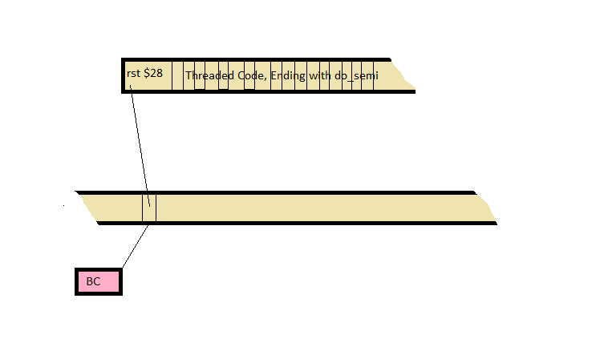

# Zed8E FORTH Inner Interpreter

Zed8E FORTH uses a direct threaded inner interpreter. This file will take
a deep dive into the design decisions that went into this code.

## Register Mapping

The FORTH virtual machine registers are mapped to the registers of the
Z-80 are used as follows:


* BC points to the next virtual machine word.
* IX is the virtual machine's return stack pointer.
* IY is a short-cut pointer to the virtual machine's next routine.
* SP is the virtual machine's data stack pointer.
* All other registers are working registers that are not preserved
accross words.
* Note: On entry to a word, HL points to the start address of that word.

## Code Words

The following shows the activity associated with a code word.


As can be seen, the BC register points to a word in the code stream. That
word is fetched into the HL register and execution of the code word
begins at that address.

The simple code that gets this done is:

```
next:
    ld      a,(bc)      ; Fetch the next instruction.
    inc     bc
    ld      l,a
    ld      a,(bc)
    inc     bc
    ld      h,a
    jp      hl          ; Execute it.
```

## Threaded Words

The following shows the activity associated with a high level threaded word.



The action of the fetch and dispatch are unchanged. The key difference
is the rst $28 instruction that invokes the do_colon handler located at
address $28. This code is shown below.

```
do_rst_28:
    ld      (iy),b      ; Push the IP onto the RS
    dec     iy
    ld      (iy),c
    dec     iy
    pop     bc
    jp      ix          ; NEXT

```

This code pushes the current virtual instruction pointer (bc) onto the FORTH
return stack and then pops the return address (put there by the rst $28)
into bc to start threaded execution there. The jump to next (via ix) starts
execution at the new starting point.
