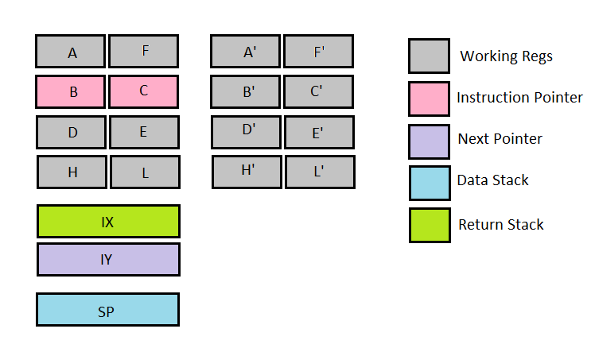

# Zed8E FORTH Inner Interpreter

Zed8E FORTH uses a direct threaded inner interpreter. This file will take
a deep dive into the design decisions that went into this code.

## Register Mapping

The FORTH virtual machine registers are mapped to the registers of the 
Z-80 are used as follows:

