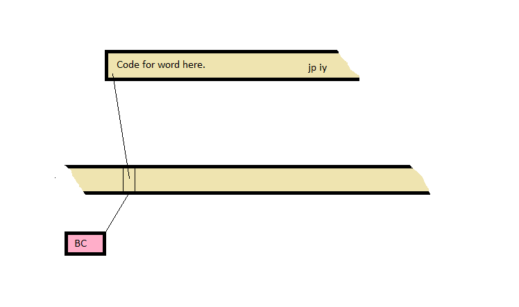

# Zed8E FORTH Inner Interpreter

Zed8E FORTH uses a direct threaded inner interpreter. This file will take
a deep dive into the design decisions that went into this code.

## Register Mapping

The FORTH virtual machine registers are mapped to the registers of the
Z-80 as follows:


* BC points to the next virtual machine word.
* IX is the virtual machine's return stack pointer. This is called `rsp` in
the source code.
* IY is a short-cut pointer to the virtual machine's next routine. This is
called `pnext` in the source code.
* SP is the virtual machine's data stack pointer.
* All other registers are working registers that are not preserved
across words.
* Note: On entry to a word, HL points to the start address of that word.

## About the rst #$nn instructions

The Z-80 has eight operation codes (inherited from the 8080) that are
specialized subroutine calls. These are the `rst $nn` instructions. They
are single byte instructions that allow subroutines to be called at
certain specific addresses. When possible, Zed8E FORTH uses these
unusual instructions because they save space, 1 byte vs. 3 bytes and time,
11 clock cycles vs. 17 clock cycles. The big limitation of the `rst` op
codes is the target address which may only be: $00, $08, $10, $18, $20,
$28, $30, and $38. Thus `rst` handlers must be eight bytes or less or
straddle more than one `rst` allocation making overlapped targets
unavailable.

## Code Words

The following shows the activity associated with a code word.



As can be seen, the BC register points to a word in the code stream. That
word is fetched into the HL register and execution of the code word
begins at that address.

The simple code that gets this done is:

```
next:
    ld      a,(bc)      ; Fetch the next instruction.
    inc     bc
    ld      l,a
    ld      a,(bc)
    inc     bc
    ld      h,a
    jp      hl          ; Execute it.
```
Code words should always end with the instruction `jp pnext` to resume
normal, threaded code execution. Code words are responsible for preserving
all FORTH virtual machine registers, including rsp (ix), pnext (iy), and bc.

## Threaded Words

The following shows the activity associated with a high level threaded word.


The action of the fetch and dispatch are unchanged. The key difference
is the `rst $08` instruction that invokes the do_colon handler located at
address $08. Recall that the `rst` instruction pushes the address of the
byte following it onto the stack. This code is shown below.

```
    pad_to  $0008       ; Entry point for rst $08 or do_colon
    define  do_colon rst $08
    ld      (rsp),b     ; Push the IP onto the RS
    dec     rsp
    ld      (rsp),c
    dec     rsp
    pop     bc          ; Get the address saved by rst $08.

    ; code falls through to the "next" code (see above).
```

This code pushes the current virtual instruction pointer (bc) onto the FORTH
return stack and then pops the return address (put there by the rst $28)
into bc to start threaded execution there. The jump to next (via ix) starts
execution at the new starting point.

For completeness, consider the routine that is the opposite of do_colon,
namely do_semi (for semi-colon).

```
cfa_do_semi:
    inc     rsp         ; Pop the IP from the RS
    ld      c,(rsp)
    inc     rsp
    ld      b,(rsp)
    jp      pnext
```

## Builds Does Code Words

This next section deals with classic FORTH `<builds ... does>` words where
the implementation of the `does>` portion is in assembly code.


Since the target for the does portion can be almost anywhere in memory,
the restrictions of the `rst` instruction cannot be used and the full
three byte `call` instruction is required. The destination of this `call`
is the `does>` assembly code.

## Builds Does Threaded Words

A `<builds ... does>` word where the implementation of the `does>`
portion is threaded code is almost identical to the code case. The only
difference is the the `does>` code starts with a `rst #$08` or do_colon
byte to switch to high level code.
